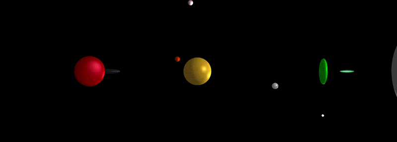
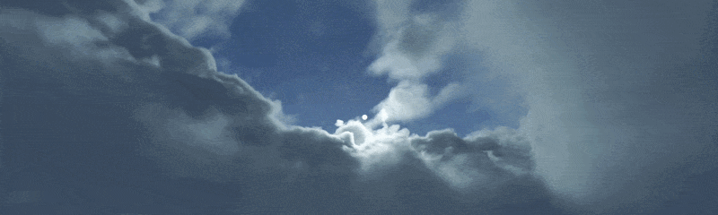
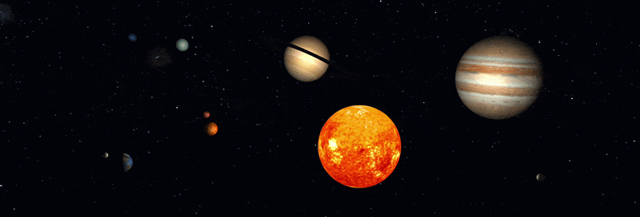
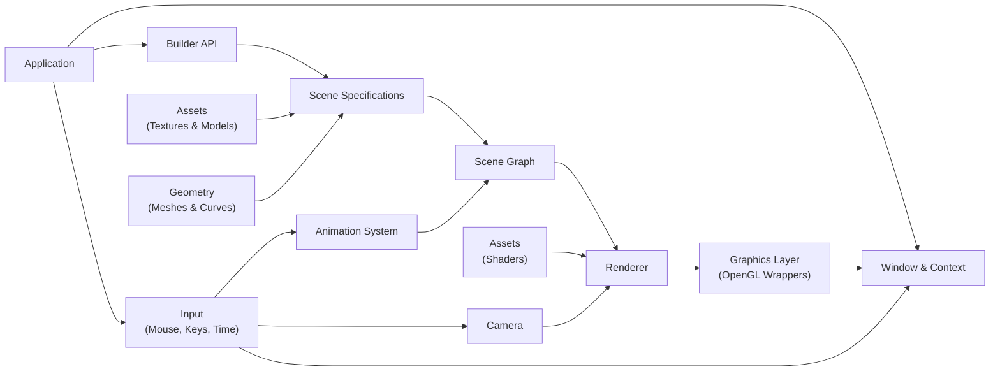

# 🎨 PixelForge - Modular OpenGL Rendering Framework

     

**PixelForge** is a modular **OpenGL-based rendering framework** that provides a clean and extensible abstraction over the graphics pipeline. It enables structured scene construction, animation, lighting, and procedural geometry generation through a well-organised architecture.

The framework focuses on:
- building a cohesive rendering pipeline abstraction
- structuring complex scenes through a scene graph
- enabling flexible scene construction through builder patterns
- supporting animation systems and hierarchical transformations
- maintaining modular and testable graphics code

---
## ✨ Key Features

- OpenGL abstraction layer:
    - wrappers for Vertex Array, Vertex Buffer, and Index Buffer
    - Shader and Uniform variable management within the Renderer
    - vertex buffer layout and vertex data abstraction
- Scene graph architecture:
    - hierarchical node system
    - transform propagation
    - modular scene composition
- Builder-based scene construction:
    - declarative creation of scenes, models, lights, and animations
    - separation of specification and compilation
- Animation system:
    - keyframe animations
    - curve-based motion (Bezier, Lagrange, B-Spline, Hermite, NURBS)
    - orbiting and transformation animations
- Lighting system:
    - ambient, directional, positional, and spotlights
    - can be animated by attachment to light unit nodes
- Material and texturing:
    - textured and untextured materials
    - cube maps for skyboxes / textures for sky spheres
- Procedural geometry:
    - primitive meshes (cube, sphere, cylinder, torus, etc.)
    - advanced parametric meshes utilising curves
- Instance & resource management:
    - centralized managers for meshes, materials, textures, animations, etc.
- Extensive unit and integration tests using **doctest**

---
## 🧰 Technology Stack

- C++20
- CMake
- OpenGL
- GLFW
- GLEW
- GLM & Eigen
- SOIL2
- doctest
- Git & GitHub
- GitHub Actions

---
## 📸 Screenshots / Demonstration

### Basic Scene Demo


### Sky Box Demo


### Solar System Demo


---
## 🚀 Running the Examples

#### Requirements:
- C++20 compatible compiler
- CMake ≥ 3.10
- OpenGL environment

#### Build:
```shell
cmake -S . -B build
cmake --build build
```

#### Running Examples:
```shell
./build/examples/pixelforge-demo <demo-name>    # specific demo
# OR
./build/examples/pixelforge-demo   # interactive selection mode
```

Available demos (listable via `--list`/`-l` argument):
- `basic-scene` - basic geometry and lighting demo
- `skybox-demo` - rendering of a randomly chosen skybox
- `solar-system` - animated solar system simulation

---
## 🏗 Architecture

PixelForge is structured into modular subsystems that reflect the rendering pipeline and scene management responsibilities.

### High-Level Overview



### Module Overview

#### `core/`:
- Application lifecycle, window/context management, camera and input handling, renderer orchestration.

#### `graphics/`:
- abstraction layer for OpenGL pipeline (vertex arrays, buffers, buffer layout)
- definitions for textures, cube maps and materials
- management and orchestration of GPU resource uploads

#### `geometry/`:
- procedural mesh construction as well as `.obj` asset loading
- parametric curves (Bézier, Lagrange, Hermite, B-Spline, NURBS)

#### `scene/`:
- lighting entities (ambient, positional, directional, spotlight)
- basic transforms (translation, rotation, scale)
- animation system (e.g. keyframe, orbiting, curve-based)
- node types for defining scene graphs respecting hierarchical transforms

#### `builders/`:
- high-level scene construction API to enable declarative scene definitions
- separates specification (what to build) from compilation (how to build runtime objects)

#### `managers/`:
- centralised ownership of resources for memory-efficient reusability
- registry for meshes, curves, textures, materials, animations, scene nodes

---
## 🧠 Design & Engineering Decisions

### OpenGL Abstraction

Low-level OpenGL constructs are wrapped into reusable components such as:

- `VertexArray`, `VertexBuffer`, `IndexBuffer`
- `VertexBufferLayout` for structured attribute definitions

This decouples rendering logic from raw API calls and improves maintainability.


### Scene Graph Architecture

The framework uses a hierarchical scene graph:

- parent-child relationships define transformations
- complex scenes are composed from simple nodes
- logical structure is separated from rendering execution


### Builder + Compiler Pattern

Scene construction follows a two-step approach:

- **Builders** describe *what* should be created
- **Compilers** transform specifications into runtime objects

This enables:

- declarative scene definitions
- separation of configuration and execution
- flexible and extensible construction pipelines


### Animation System

Multiple animation paradigms are supported:

- transformation-based animation
- keyframe sequences
- curve-driven motion
- orbital systems


### Resource Management

Dedicated managers centralise ownership and reuse of:

- meshes and curves
- materials and textures
- animations
- scene nodes

This avoids duplication and enforces clear lifecycle management.

---
## 🗃️ Project Structure

```text
.
├── CMakeLists.txt
├── README.md
├── cmake/                # CMake helper modules and package config
│
├── assets/               # Static data resources
│   ├── models/             → sample OBJ assets
│   ├── shaders/            → vertex/fragment shaders + shared GLSL code
│   └── textures/           → demo textures, skyboxes, solar system assets
│
├── external/             # bundled third-party dependencies
│   ├── EIGEN/              → linear algebra library (matrices, vectors)
│   ├── GLEW/               → OpenGL extension loading
│   ├── GLFW/               → windowing and input handling
│   ├── GLM/                → OpenGL-focused math library
│   ├── SOIL2/              → image loading for textures
│   └── doctest/            → lightweight C++ testing framework
│
├── include/pixelforge/   # Public API exposing:
│   ├── core/               → application, window, camera
│   ├── graphics/           → OpenGL wrappers, pipeline, texturing
│   ├── geometry/           → meshes, curves, utilities
│   ├── scene/              → scene graph, animation, lighting, transforms
│   ├── builders/           → public scene construction API
│   └── *.hpp               → Umbrella headers for easy inclusion
│
├── src/                  # Private implementation and helpers:
│   ├── core/               → renderer, input, context handling
│   ├── graphics/           → buffer/shader/texture implementations
│   ├── geometry/           → procedural mesh and curve implementations
│   ├── scene/              → nodes, lights, animations, transforms
│   ├── builders/           → specification compilers + legacy builders
│   └── managers/           → centralized resource and instance managers
│
├── examples/             # Showcase scenes
│   ├── main.cpp
│   ├── demo_registry.*
│   └── scenes/
│       ├── basic_demo.*
│       ├── skybox_demo.*
│       └── solar_system_demo.*
│
├── tests/
│   ├── core/
│   ├── graphics/
│   ├── geometry/
│   ├── scene/
│   ├── builders/
│   ├── managers/
│   ├── integration/
│   ├── test_main.cpp
│   └── test_main_gl_context.cpp
│
└── docs/
```

---
## 🧪 Testing

The project includes a comprehensive test suite using **`doctest`**.

Covered Areas:
- geometry generation (meshes, curves)
- graphics pipeline components
- scene graph and transformations
- animation systems
- resource managers
- integration pipelines:
    - animation + transform pipeline
    - scene construction pipeline
    - material + texture pipeline


#### Building core tests:
```shell
cmake -S . -B build -DPIXELFORGE_BUILD_TESTS=ON
cmake --build build
```
Core tests are organized by subsystem (e.g. `geometry/`, `scene/`, `managers/`, `graphics/`, `integration/`) to reflect the project architecture and ensure clear coverage of both individual components and their interactions.

#### Building OpenGL-backed tests:
```shell
cmake -S . -B build -DPIXELFORGE_BUILD_GL_TESTS=ON
cmake --build build
```
OpenGL-related tests run inside a hidden GLFW context and are separated from the core suite. They verify GPU resources such as buffers, shaders, textures, and rendering setup. These tests are optional and may be disabled in environments without graphics support.

#### Running tests via `ctest`:
```shell
ctest --test-dir build
# OR
ctest --test-dir build -V    # verbose output (shows individual test cases)
```

#### Running tests via `pixelforge-tests` (or `pixelforge-tests-gl`) executable:
```shell
./build/tests/pixelforge-tests
# OR
./build/tests/pixelforge-tests -s                  # show all test cases
# OR
./build/tests/pixelforge-tests --list-test-cases   # list all test cases
```

---
## 🎯 What This Project Demonstrates

This project showcases:
- clean modular C++ architecture
- abstraction of low-level OpenGL concepts
- scene graph implementation
- builder + compiler design pattern
- procedural geometry and spline mathematics
- animation systems in rendering pipelines
- resource and memory management strategies
- extensive unit and integration testing
- scalable and extensible engine design

It serves as a portfolio project demonstrating foundations of real-time rendering and graphics system design.

---
## 🗺 Roadmap

Planned extensions include:
- skeletal animation
- normal mapping
- shadow mapping
- shader storage buffer objects (SSBOs)
- more advanced rendering techniques

---
## 🙌 Get Involved

Feel free to:
- explore the architecture and rendering pipeline
- extend the framework with new features
- add new scene types or animations
- use the project as a reference for OpenGL-based engine design

---
### Thanks for Visiting!

PixelForge represents an ongoing effort to build a structured and extensible rendering framework while exploring real-time graphics concepts in depth.

Happy coding! 🚀